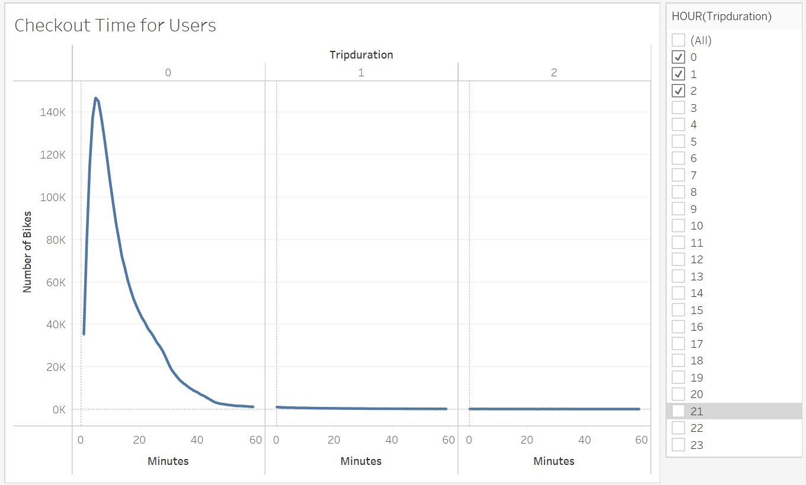
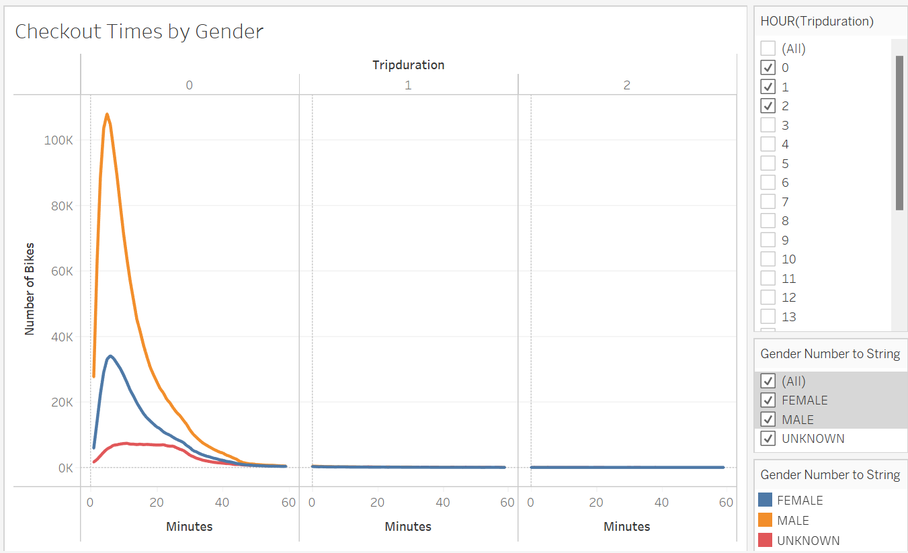
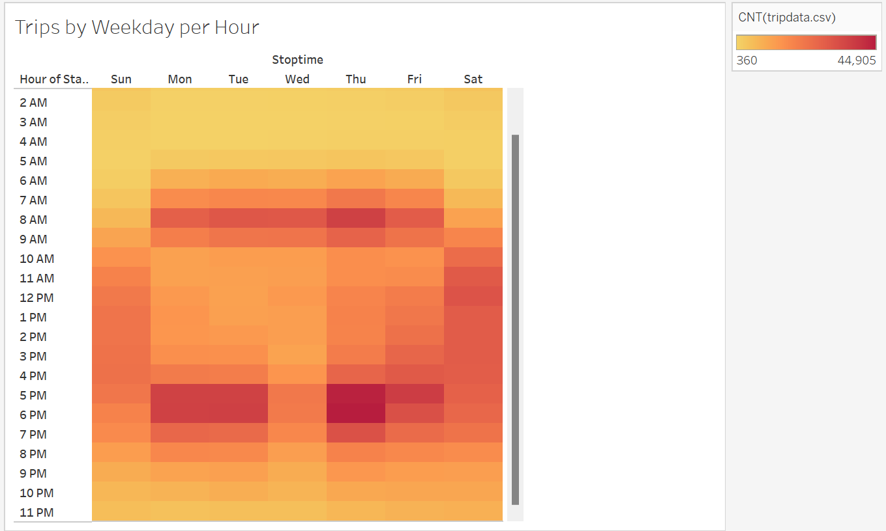
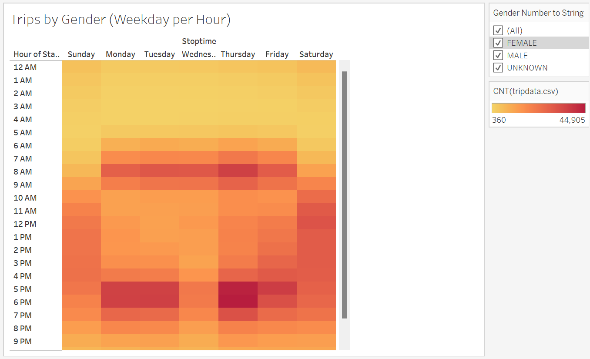
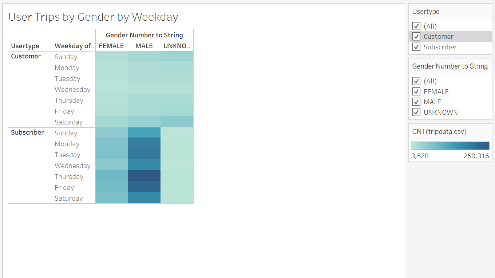
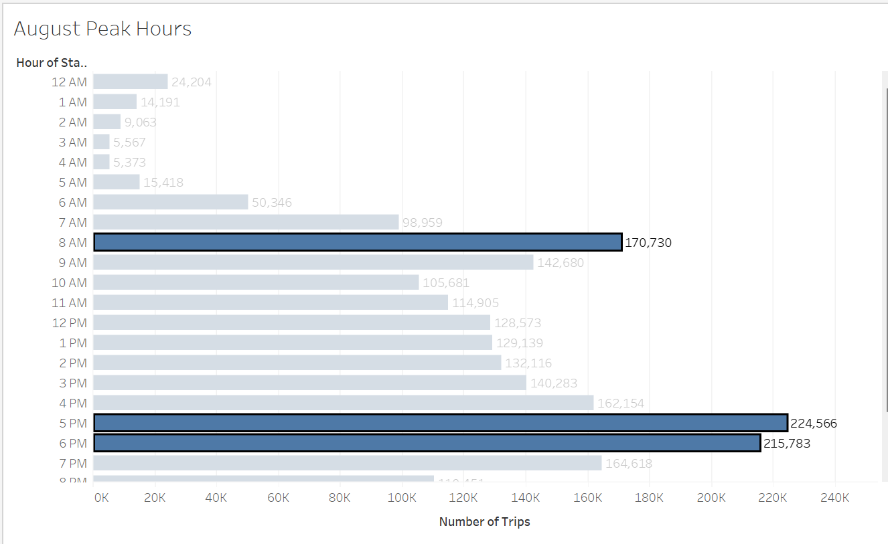
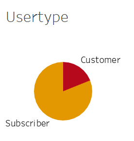

# Bikesharing

[link to dashboard]([LINK GOES HERE](https://public.tableau.com/app/profile/leishka.marrero/viz/NYCCitibikeAnalysis_16799755129480/NYCCitibikeAnalysis?publish=yes))

## Purpose
Use Tableu to provide a business proposal to begin a bike-sharing program in Des Moines, Iowa. We will be using Citi Bike data from New York to create a set of visualizations that summarize the average ride durations, type of users, and peak hours.

## Results
### Checkout Time for Users

This graph shows the length of time that bikes are checked out for all riders. Most trips range from 5 minutes to 40 minutes. 

### Checkout Times by Gender

We can see a correlation between males and females regarding length of time of rides. Most rides are short-term with a peak of 5 to 10 minutes for both genders. Male line chart is much higher because they make up 65% of our customer base.

### Trips by Weekday per Hour

This graph shows the number of trips by weekday per hour. From this chart we can conclude that most bikes are being used as a mode of transportation to and from work with peak hours of 8AM and 5PM from Monday to Friday. During the weekend, the rides average from 10AM to 5PM.

### Trips by Gender (Weekday per Hour)

This graph shows gender is unrelated to the number of trips by weekday per hour. Both genders have peak hours of Monday thru Friday at 8AM and 5-6PM. A highlight the graph shows is more females ride on weekends than males.

### Usertrips by Gender by Weekday

This graph shows the number of trips by weekday and gender separated into short-term customers and annual subscribers. When looking at the numbers for short-term customers, most are used during the weekend. Given that 65% of our customer base is male, the number of male annual subscribers is larger than female annual subscribers. Thursday and Friday are peak days for male annual subscribers.

### August Peak Hours

August Peak Hours can show different points of data. This chart shows how many bikes will be needed during peak hours. Peak hours are from 5PM to 7PM with a total of 224,566 rides. It also allows us to plan the best times for bike maintenance. Best time for maintenance would be overnight from 1AM to 5AM. 

### Usertype

This graph shows the number of short-term customers and annual subscribers to the Citi Bike service. Out of 2,344,224 rides, 1,900,359 were annual subscribers and 443,865 were short-term customers. This information allows us to conclude that this service would be used as routine transportation instead of recreational use. 

## Summary
Total number of rides for NYC Citibike Analysis in August are 2,344,224. Of these, 81% are annual subscribers and 65% are male. Most bikes are being used Monday thru Friday during the peak hours of 8AM and 5PM. This allows us to conclude these are being used as a mode of transportation to and from work. Most ride durations are between 5 to 10 minutes. 

A visualization needed to get an overall picture of usage would include a years worth of ride data. This would allow us to get a better look at our peak months and our slow months. An important piece of information missing is ride cost. We can get a visualization of average cost per ride to get a better look at our potential profits. 
